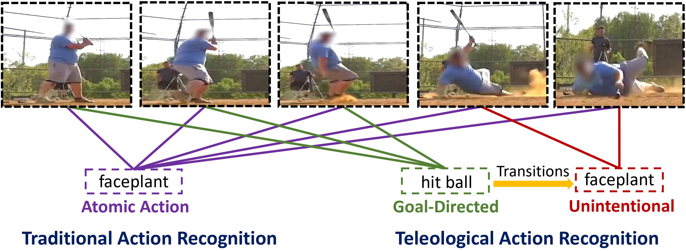

# Tragedy Plus Time: Capturing Unintended Human Activities from Weakly-labeled Videos

<p align="center">
  
</p>


Robustness in Sequential Data Workshop @ CVPR 2022


Project Website: https://asu-apg.github.io/TragedyPlusTime/


Dataset: https://drive.google.com/drive/folders/1yy8P208lJdD4dc7KXjA_GUAzimQX9C4n?usp=sharing

## Train Model
```
python main.py --model-name gru --p 1000 --q 10 --Lambda 0.8
```

## Evaluation

### Classification Performance
| Architecture | Feature | GOAL cMAP | UNINT cMAP |
|--------------|:-------:|:---------:|:----------:|
| STPN         |   I3D   |   45.3    |    37.5    |
| WTALC        |   I3D   |   50.2    |    38.2    |
| A2CL-PT      |   I3D   |   48.5    |    34.8    |
| Ours         |   I3D   | **52.6**  |  **41.1**  |

### Localization Performance
<table>
    <thead>
        <tr>
            <th>Model</th>
            <th>Feature</th>
            <th>Segment</th>
            <th>AVG mAP@IoU</th>
        </tr>
    </thead>
    <tbody>
        <tr>
            <td rowspan="2">STPN</td>
            <td rowspan="2">I3D</td>
            <td>Goal</td>
            <td>21.5</td>
        </tr>
        <tr>
            <td>Unint</td>
            <td>15.0</td>
        </tr>
        <tr>
            <td rowspan="2">WTALC</td>
            <td rowspan="2">I3D</td>
            <td>Goal</td>
            <td>19.7</td>
        </tr>
        <tr>
            <td>Unint</td>
            <td>8.8</td>
        </tr>
<tr>
            <td rowspan="2">A2CL-PT</td>
            <td rowspan="2">I3D</td>
            <td>Goal</td>
            <td>22.2</td>
        </tr>
        <tr>
            <td>Unint</td>
            <td>12.5</td>
        </tr>
<tr>
            <td rowspan="2">Ours</td>
            <td rowspan="2">I3D</td>
            <td>Goal</td>
            <td><b>35.0</b></td>
        </tr>
        <tr>
            <td>Unint</td>
            <td><b>26.0</b></td>
        </tr>
    </tbody>
</table>